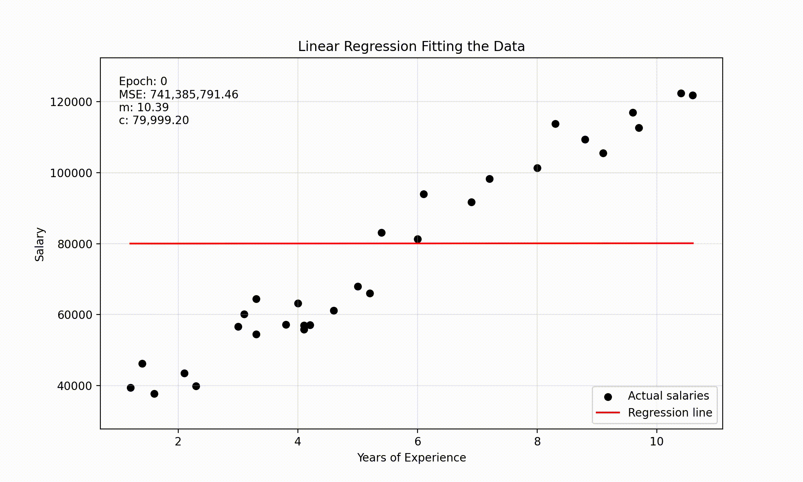
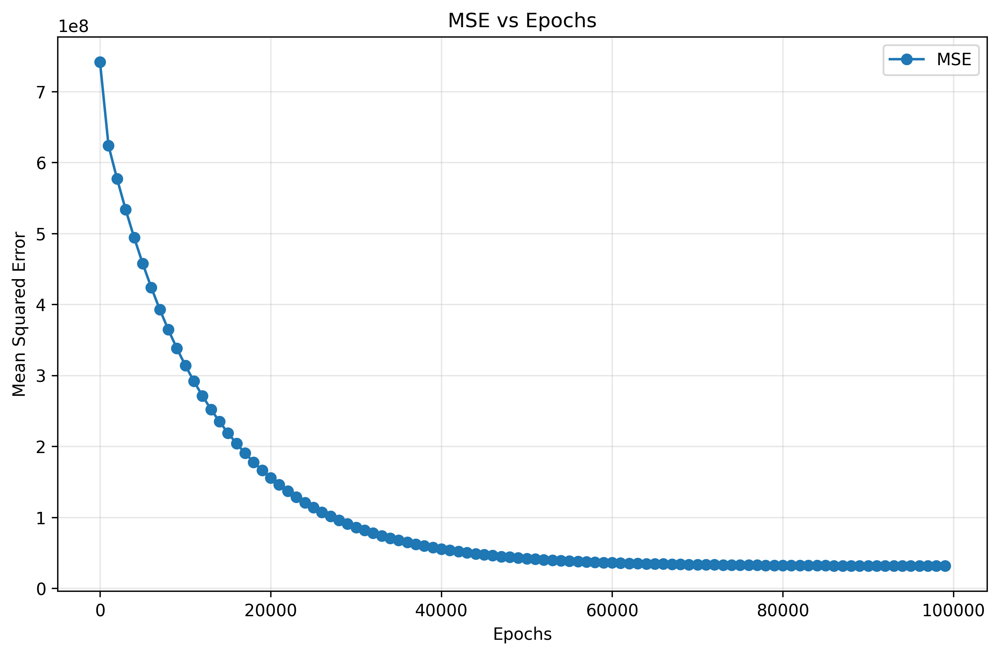
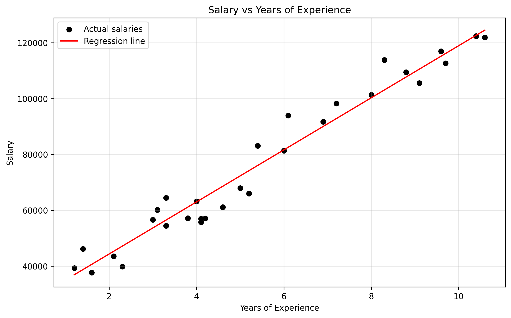

# Linear Regression from Scratch

A simple Python project that implements linear regression from scratch using gradient descent.

The model learns the relationship between years of experience and salary without using Scikit-learn.

## Overview

This project includes:

* Mean Squared Error as the loss function
* Gradient descent
* Manual calculation of the slope and intercept
* A visualisation of the fitted regression line

The model uses:

Learning rate = 0.0001

Epochs = 100000

## Training Animation



## MSE vs Epochs



## Final Regression Line



## Project Structure

```text
Salary_Linear_Regression_From_Scratch/
│
├── .venv/
│
├── assets/
│   ├── final_regression_line.png
│   ├── linear_regression_training.gif
│   ├── linear_regression_training.mp4
│   └── mse_vs_epochs.png
│
├── data/
│   └── Salary_dataset.csv
│
├── src/
│   └── model.py
│
├── .gitignore
├── main.py
├── README.md
└── requirements.txt
```

## Running the Project

Setup instructions:

```bash
pip install -r requirements.txt
brew install ffmpeg
```

Run the program:

```bash
python main.py
```

## Technologies

* Python
* Pandas
* Matplotlib
